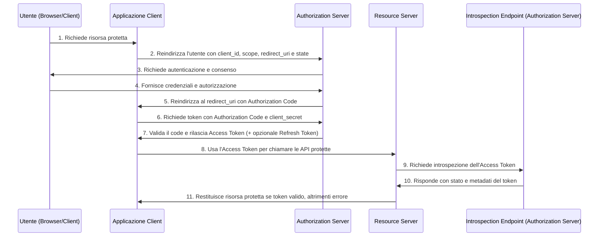

```mermaid
sequenceDiagram
    participant User as Utente (Browser/Client)
    participant Client as Applicazione Client
    participant Auth as Authorization Server
    participant Resource as Resource Server
    participant Introspection as Introspection Endpoint (Authorization Server)

    User->>Client: 1. Richiede risorsa protetta
    Client->>Auth: 2. Reindirizza l'utente con client_id, scope, redirect_uri e state
    Auth->>User: 3. Richiede autenticazione e consenso
    User->>Auth: 4. Fornisce credenziali e autorizzazione
    Auth->>Client: 5. Reindirizza al redirect_uri con Authorization Code
    Client->>Auth: 6. Richiede token con Authorization Code e client_secret
    Auth->>Client: 7. Valida il code e rilascia Access Token (+ opzionale Refresh Token)
    Client->>Resource: 8. Usa l'Access Token per chiamare le API protette
    Resource->>Introspection: 9. Richiede introspezione dell'Access Token
    Introspection->>Resource: 10. Risponde con stato e metadati del token
    Resource->>Client: 11. Restituisce risorsa protetta se token valido, altrimenti errore
```
